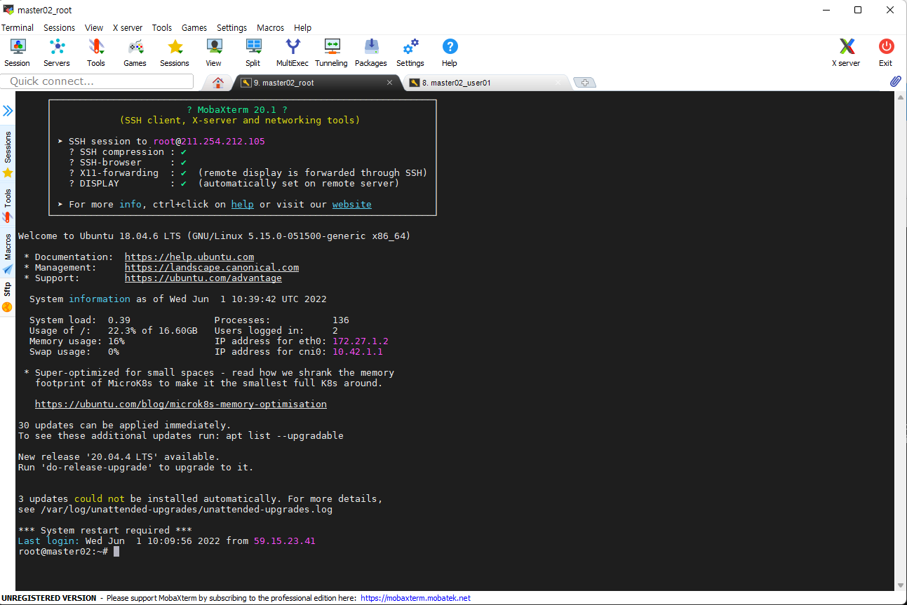
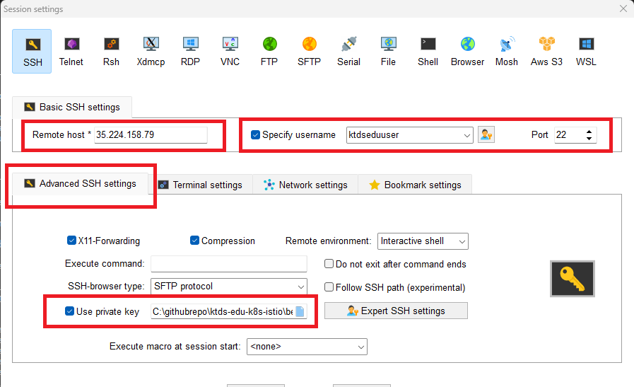

# < 시작전에 >


# 1. 실습 환경 준비(개인PC)


## 1) mobaXterm 설치

Cloud VM에 접근하기 위해서는 터미널이 필요하다.

CMD / PowerShell / putty 와 같은 기본 터미널을 이용해도 되지만 좀더 많은 기능이 제공되는 MobaxTerm(free 버젼) 을 다운로드 하자.


- download 위치
  - 링크: https://download.mobatek.net/2312023031823706/MobaXterm_Installer_v23.1.zip

- mobaxterm 실행




## 2) gitbash 설치

교육문서를 다운로드 받으려면 Git Command 가 필요하다. Windows 에서는 기본 제공되지 않아 별도 설치 해야 한다.

- 다운로드 주소 : https://github.com/git-for-windows/git/releases/download/v2.40.1.windows.1/Git-2.40.1-64-bit.exe
- 참조 링크 : https://git-scm.com/


## 3) Typora 설치

교육자료(MarkDown 문서)를 typora로 확인하기 위해 Typora를 설치한다. 

github site 를 직접 확인해도 되긴 하지만 각종 실습 자료를 직접 수정해야 하므로 가능한 Typora 를 이용하자.


### (1) Typora 설치

- 참고
  - 링크: https://typora.io/

- download 위치
  - 다운로드주소 : https://download.typora.io/windows/typora-setup-x64.exe

- Typora 실행


### (2) Typora 환경설정

원할한 실습을 위해 코드펜스 옵션을 아래와 같이 변경하자.

- 코드펜스 설정
  - 메뉴 : 파일 > 환경설정 > 마크다운 > 코드펜스
    - 코드펜스에서 줄번호 보이기 - check
    - 긴문장 자동 줄바꿈 : uncheck


- 개요보기 설정
  - 메뉴 : 보기 > 개요
    - 개요 : check


# 2. 교육문서 Download

실습을 위해서 해당 자료를 download 하여 markdown 전용 viewer 인 Typora 로 오픈하여 실습에 참여하자.


## 1) 개인 PC에 교육자료 download

gitbash 실행후 command 명령어로 아래와 같이 디렉토리를 생성후 git clone 으로 download 하자.

```sh
## githubrepo directory 생성
$ mkdir -p /c/githubrepo

$ cd /c/githubrepo

$ git clone -b 20240219_3p1t https://github.com/ssongman/ktds-edu-k8s-istio.git
Cloning into 'ktds-edu-k8s-istio'...
remote: Enumerating objects: 427, done.
remote: Counting objects: 100% (54/54), done.
remote: Compressing objects: 100% (39/39), done.
remote: Total 427 (delta 26), reused 36 (delta 14), pack-reused 373
Receiving objects: 100% (427/427), 3.84 MiB | 8.82 MiB/s, done.
Resolving deltas: 100% (212/212), done.


$ ll /c/githubrepo
drwxr-xr-x 1 ssong 197609 0 Aug 27 15:19 ktds-edu-k8s-istio/

```


만약 교육중 (오타 변경 등의 사유로) 자료가 변경되어 다시 받아야 하는 경우 가 있을 경우 해당 위치에서 git pull 만 다시 받도록 하자.

```sh
$ cd /c/githubrepo/ktds-edu-k8s-istio

$ git pull

```


## 2) Typora 로 readme.md 파일오픈

- typora 로 오픈
  - 파일열기(Ctrl + O)  후 아래 파일 오픈


```
## typora 에서 아래 파일 오픈

C:\githubrepo\ktds-edu-k8s-istio\README.md
```


# 3. 실습 환경 준비(Cloud)

본 교육 과정에서의 모든 실습은 Cloud 에서 수행할 것이다.


## 1) 개인 VM 서버 주소 확인- ★

원할한 실습을 위해서 개인별 한개씩 VM 이 할당되어 있다.  해당 노드에 kubernetes 를 설치 및 다양한 실습을 진행할 것이다.

수강생별 개인 VM Server 접속 주소를 확인하자. 또한 KtdsEduCluster 에서 사용할 개인별 Namespace 를 확인하자.


###  3인 1조 체제 운용시

2024.02.18 기준

* 현재 개인당 ec2 server 할당과정에서 cpu quota 를 초과하여 7개까지만 생성이 완료된 상태임.

* cpu quota 증설을 요청해 놓은 상태임.

* 실습 시간전까지 bastion server 할당 받지 못할 경우 아래와 같이 3인 1조 체제로 bastion server 가 운용 될 예정


| 이름   | email                                             | Namespace | VM  Server | VM  Server IP  | 비고 |
| ------ | ------------------------------------------------- | --------- | ---------- | -------------- | ---- |
| 송양종 | 강사1                                             | user01    |            |                |      |
| 송양종 | 강사2                                             | user02    | bastion01  | 43.202.56.89   |      |
| 장진호 | [jinhoss.jang@kt.com](mailto:jinhoss.jang@kt.com) | user03    |            |                |      |
| 유광선 | [ksyoo@kt.com](mailto:ksyoo@kt.com)               | user04    |            |                |      |
| 박성준 | [sj.park1203@kt.com](mailto:sj.park1203@kt.com)   | user05    | bastion02  | 54.180.160.149 |      |
| 노수윤 | [syno@kt.com](mailto:syno@kt.com)                 | user06    |            |                |      |
| 배진용 | [baejy@kt.com](mailto:baejy@kt.com)               | user07    |            |                |      |
| 김인세 | [inse.kim@kt.com](mailto:inse.kim@kt.com)         | user08    | bastion03  | 43.201.58.161  |      |
| 여준영 | [junyeong.yeo@kt.com](mailto:junyeong.yeo@kt.com) | user09    |            |                |      |
| 박영은 | [zerois.park@kt.com](mailto:zerois.park@kt.com)   | user10    |            |                |      |
| 권성광 | [sg.kwon@kt.com](mailto:sg.kwon@kt.com)           | user11    | bastion04  | 43.202.63.101  |      |
| 박영은 | [ye.park@kt.com](mailto:ye.park@kt.com)           | user12    |            |                |      |
| 홍문기 |                                                   | user19    | bastion05  | 13.125.34.128  |      |
| 조성희 | [ishcho@kt.com](mailto:ishcho@kt.com)             | user13    |            |                |      |
| 정유빈 | [youbin.jeong@kt.com](mailto:youbin.jeong@kt.com) | user14    |            |                |      |
| 장병훈 | [bottle.jang@kt.com](mailto:bottle.jang@kt.com)   | user15    | bastion06  | 13.125.196.124 |      |
| 박윤형 | [sally.park@kt.com](mailto:sally.park@kt.com)     | user16    |            |                |      |
| 강민수 | [edward.kang@kt.com](mailto:edward.kang@kt.com)   | user17    | bastion07  | 13.125.108.5   |      |
| 이규용 | [leegy33@kt.com](mailto:leegy33@kt.com)           | user18    |            |                |      |


## 2) SSH (Mobaxterm) 실행

Mobaxterm 을 실행하여 VM 접속정보를 위한 신규 session 을 생성하자.

- 메뉴
  - session  : 상단 좌측아이콘 클릭

  - SSH : 팝업창 상단 아이콘 클릭




빨간색 영역을 주의해서 입력한후 접속하자.


- Romote host
  - 개인별로 접근 주소가 다르므로 위 수강생별  VM  Server IP 주소를 확인하자.
  - ex)  bastion02 : 54.180.160.149  (샘플)

- User
  - Specify username 에 Check
  - User : ubuntu 입력

- Port : 22
- Advanced SSH settings
  - Use private key : C:\githubrepo\ktds-edu-k8s-istio\beforebegin\vm-key\ktdsedu-employee.pem
    - 교육자료 Download 되는 자료에 위 key가 포함되어 있음


## 3) VM 서버에서 실습자료 download

실습 테스트를 위해서 실습 자료를 받아 놓자.

이미 각자 VM에 해당 교육자료가  git clone 되어 있으므로 git pull 로 최신 데이터로 update 만 진행하자.


###  3인 1조 체제 운용시

동일 bastion server 에서 3인이 사용해야 하므로 namespace 명으로 디텍토리 구조를 생성한다.

user02 대신 다신의 namespace 명으로 변경하여 수정한다.

```sh
# 1) 교육자료를 clone 받는다.
$ mkdir -p ~/user02/githubrepo
$ cd ~/user02/githubrepo
$ git clone -b 20240219_3p1t https://github.com/ssongman/ktds-edu-k8s-istio.git

Cloning into 'ktds-edu-k8s-istio'...
remote: Enumerating objects: 578, done.
remote: Counting objects: 100% (205/205), done.
remote: Compressing objects: 100% (142/142), done.
remote: Total 578 (delta 116), reused 146 (delta 60), pack-reused 373
Receiving objects: 100% (578/578), 3.90 MiB | 26.25 MiB/s, done.
Resolving deltas: 100% (302/302), done.


# 2) 확인
$ cd ~/user02/githubrepo/ktds-edu-k8s-istio
$ ll
drwxrwxr-x 6 ubuntu ubuntu 4096 Feb 18 23:17 ktds-edu-k8s-istio/


# 3) 최신 데이터를 한번 더 받아야 하는 경우
$ cd ~/user02/githubrepo/ktds-edu-k8s-istio/
$ git pull

```


#### git pull 실패한 경우

만약 기 수정 파일이 존재하여 pull이 잘 안되는 경우는 삭제후 다시 clone

```sh


# < 만약 기 수정 파일이 존재하여 pull이 잘 안되는 경우는 삭제후 다시 clone >

# 1) 모두 삭제
$ rm -rf ~/user02/githubrepo/ktds-edu-k8s-istio/

# 2) git clone 수행
$ cd ~/user02/githubrepo
$ git clone https://github.com/ssongman/ktds-edu-k8s-istio.gitvk
Cloning into 'ktds-edu-k8s-istio'...
remote: Enumerating objects: 446, done.
remote: Counting objects: 100% (73/73), done.
remote: Compressing objects: 100% (53/53), done.
remote: Total 446 (delta 34), reused 50 (delta 18), pack-reused 373
Receiving objects: 100% (446/446), 3.86 MiB | 7.60 MiB/s, done.
Resolving deltas: 100% (220/220), done.

# 3) 확인
$ ll ~/user02/githubrepo
drwxrwxr-x 7 ktdseduuser ktdseduuser 4096 May 13 17:36 ktds-edu-k8s-istio/

$ cd ~/user02/githubrepo/ktds-edu-k8s-istio/

```


### [참고] git repo 초기화 방법

수정된 파일이 존재하여 git pull 이 잘 안될때는 삭제후 다시 Clone 하는 방법도 있지만 

내용이 많다거나 다른 사유로 인해 clone 작업이 힘들 경우 아래와 같은 명령어를 사용해도 된다..

```sh


# 1) 마지막 commit hash 값으로 reset 처리
## 아직 staged 에 올라가지 않은 수정파일,  untracked file 까지 모두 사라진다.
$ git reset --hard HEAD~


# 2) untrackted file 을 초기화 해야 하는 경우
$ git clean -f -d


# 3) 파일단위로 restore 를 원할 경우
$ git restore modified_file


# 참고
## commit log 확인
$ git log --oneline -n10
```

