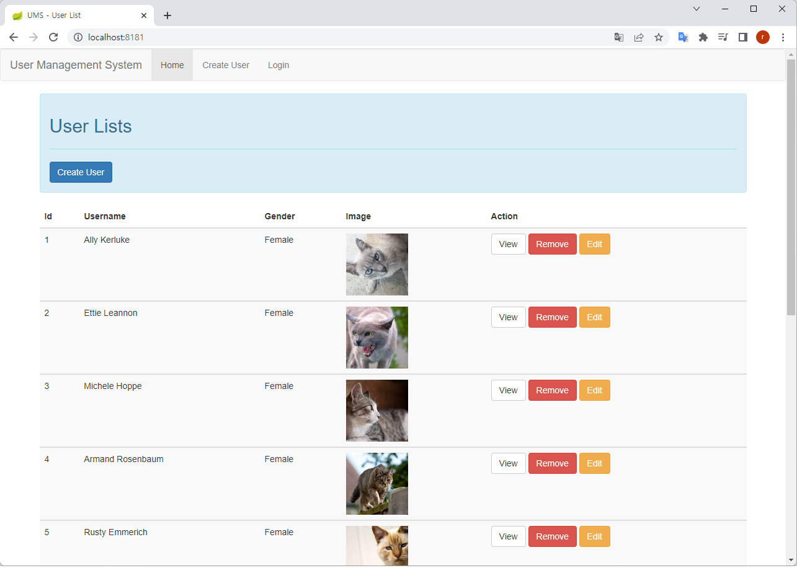
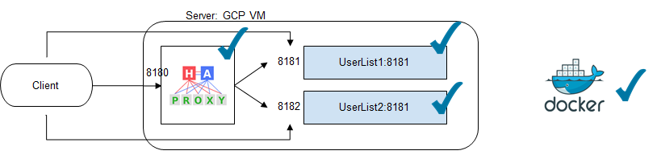
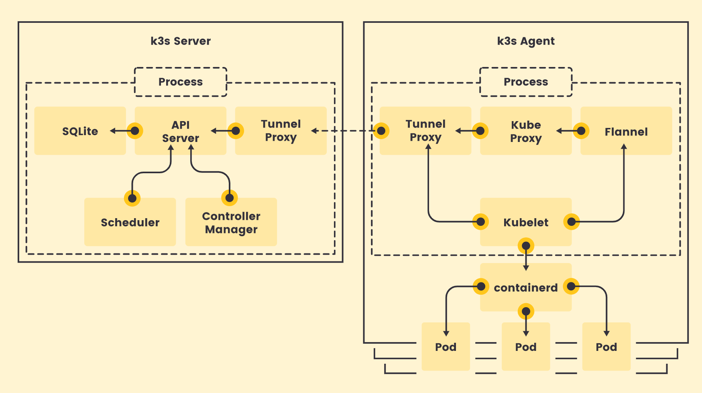
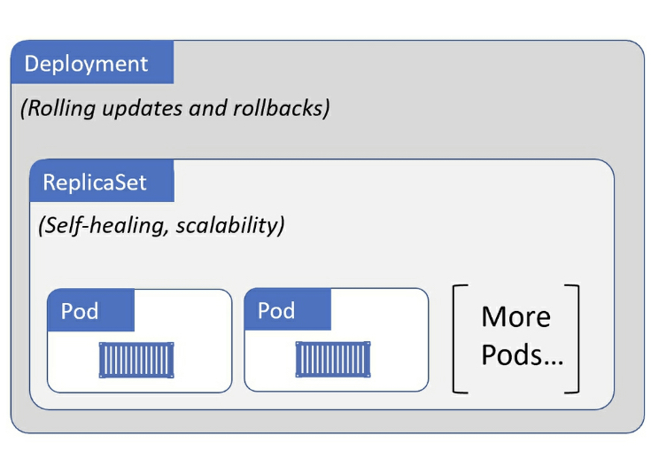
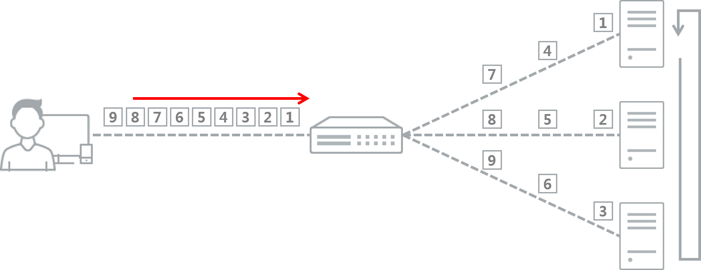
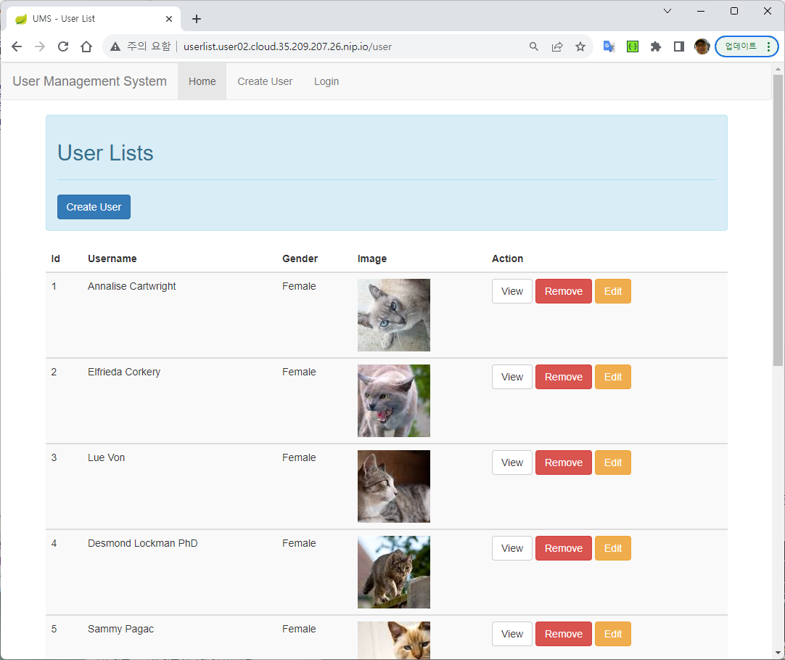

# < 1교시: kubernetes 맛보기 >


# 1. Kubernetes


## 1) Container 개요


### (1) Container

* AP 와 Binary, Library 를 Package 로 묶어서 배포
* 서로 다른 컴퓨팅 환경에서 AP를 안정적으로 실행 할 수 있음
* 개발환경에 구애 받지 않고 빠른 배포가 가능(OS 커널 공유)
* 온프레미스 환경에서 클라우드 네이티브 환경으로 쉽게 옮겨 갈 수 있어서 클라우드 컴퓨팅 분야에서 가장 주목 받는 기술중 하나임


### (2) Container 이전 시대에는?

* 전통방식 --> VM --> Container 변천사


* **전통적인 배포 시대:** 
  * 애플리케이션을 물리 서버에서 실행
  * 한 물리 서버에서 여러 애플리케이션의 리소스 한계를 정의할 방법이 없으므로 리소스 할당 문제가 발생
    * 예를 들어 물리 서버 하나에서 여러 애플리케이션을 실행하면, 리소스 전부를 차지하는 애플리케이션 인스턴스가 있을 수 있고, 결과적으로는 다른 애플리케이션의 성능이 저하될 수 있었다. 
    * 이에 대한 해결책은 서로 다른 여러 물리 서버에서 각 애플리케이션을 실행하는 것이 있다. 
  * 비효율적 리소스 사용으로 물리 서버를 많이 유지 하는 등 많은 비용이 소요


* **가상화된 배포 시대:** 
  * 위 문제점에 대한 해결책으로 가상화가 도입되었다. 
  * 이는 단일 물리 서버의 CPU에서 여러 가상 시스템 (VM)을 실행할 수 있게 한다.
  *  가상화를 사용하면 VM간에 애플리케이션을 격리하고 애플리케이션의 정보를 다른 애플리케이션에서 자유롭게 액세스 할 수 없으므로, 일정 수준의 보안성을 제공할 수 있다.
  * 가상화를 사용하면 물리 서버에서 리소스를 보다 효율적으로 활용할 수 있으며, 쉽게 애플리케이션을 추가하거나 업데이트할 수 있고 하드웨어 비용을 절감할 수 있어 더 나은 확장성을 제공한다. 
  * 가상화를 통해 일련의 물리 리소스를 폐기 가능한(disposable) 가상 머신으로 구성된 클러스터로 만들 수 있다.
  * 각 VM은 가상화된 하드웨어 상에서 자체 운영체제를 포함한 모든 구성 요소를 실행하는 하나의 완전한 머신이다.


* **컨테이너 개발 시대:**

  * 컨테이너는 VM과 유사하지만 격리 속성을 완화하여 애플리케이션 간에 운영체제(OS)를 공유한다. 
  * 그러므로 컨테이너는 가볍다고 여겨진다. 
  * VM과 마찬가지로 컨테이너에는 자체 파일 시스템, CPU 점유율, 메모리, 프로세스 공간 등이 있다. 
  * 기본 인프라와의 종속성을 끊었기 때문에, 클라우드나 OS 배포본에 모두 이식할 수 있다.

  

### (3) 컨테이너의 특정

- 기민한 애플리케이션 생성과 배포
  - VM 이미지를 사용하는 것에 비해 컨테이너 이미지 생성이 보다 쉽고 효율적임.
- 지속적인 개발, 통합 및 배포
  - 안정적이고 주기적으로 컨테이너 이미지를 빌드해서 배포할 수 있고 (이미지의 불변성 덕에) 빠르고 효율적으로 롤백할 수 있다.
- 가시성(observability)
  - OS 수준의 정보와 메트릭에 머무르지 않고, 애플리케이션의 헬스와 그 밖의 시그널을 볼 수 있다.
- 개발, 테스팅 및 운영 환경에 걸친 일관성
  - 개인PC에서도 클라우드에서와 동일하게 구동된다.
- 클라우드 및 OS 배포판 간 이식성
  - Ubuntu, RHEL, CoreOS, 온-프레미스, 주요 퍼블릭 클라우드와 어디에서든 구동된다.
- 리소스 격리
  - 애플리케이션 성능을 예측할 수 있다.


### (4) OCI (Open Container Initiative)

* 2013년 출시된 Docker가 사실상 표준 역할을 했지만 CoreOS(현Redhat) 등 도커와 다른 규격으로 표준화를 추진하려 함
* 이런 문제를 해결하기 위해 2015년 CoreOS, 도커, 구글, AWS, MS, IBM 등 플랫폼 벤더들을 중심으로 컨테이너 표준화 수립 및 OCI 단체 출범
* 현재는 Linux Foundation 산하에 존재함
* OCI 설립 목표 중의 하나는 통일된 표준을 통해 어디서든 작동하는 이식성 제공
* OCI 표준 컨테이너가 만족해야할 5가지 원칙

| 원칙                                        | 내용                                                         |
| :------------------------------------------ | :----------------------------------------------------------- |
| 표준 동작 (Standard Operations)             | • 표준 컨테이너 도구들을 이용해서 컨테이너의 생성, 시작, 정지가 가능해야 함 <br />• 표준 파일 시스템 도구를 통해서 컨테이너의 스냅샷과 복사가 가능해야 함 <br />• 표준 네트워크 도구들을 통해서 컨테이너의 업로드와 다운로드가 가능해야 함 |
| 내용 중립성 (Content-agnostic)              | •표준 컨테이너는 컨테이너가 담고 있는 애플리케이션의 종류에 상관없이 표준 동작들이 동일하게 동작해야 함 |
| 인프라 중립성 (Infrastructure-agnostic)     | •표준 컨테이너는 OCI 지원 인프라라면 종류에 상관없이 컨테이너 실행이 가능해야 함 |
| 자동화를 위한 설계(Designed for Automation) | •표준 컨테이너는 컨테이너 내용과 인프라 종류에 상관없이 동일한 표준 동작을 지원하기 때문에 자동화가 용이함 |
| 산업 수준의 배포(Industrygrade delivery)    | •표준 컨테이너는 기업 규모에 상관없이 산업 수준의 배포가 가능해야 함 |

* OCI 표준에 맞는 대표적인 Container tool

  * Docker / Buildah / Skopeo / Podman / Cri-o / Container-D


## 2) Kubernetes 개요

- 쿠버네티스는 컨테이너화된 워크로드와 서비스를 관리하기 위한 이식성이 좋고, 확장가능한 오픈소스 플랫폼임

- 쿠버네티스는 선언적 구성과 자동화 기능을 제공하여 사용성이 용이함
- 빠르게 성장하는 생태계를 가지고 있음
- Kubernetes란 명칭은 키잡이(helmsman)나 파일럿을 뜻하는 그리스어 용어에서 유래
- K8s라고 표현하기도 함. "K"와 "s"와 그 사이에 있는 8글자를 나타내는 약식 표기
- 구글이 2014년에 쿠버네티스 프로젝트를 오픈소스로 전환, 현재는 CNCF 재단에서 관리 됨


## 3) 왜 kubernetes 가 필요한가?


- **서비스 디스커버리와 로드 밸런싱**
  - 쿠버네티스는 Service 명과 같은 DNS를 사용하거나 자체 IP 주소(ClusterIP) 를 사용하여 컨테이너를 노출할 수 있다. 
  - 쿠버네티스는 트래픽을 로드밸런싱으로 분산하여 안정적인 서비스를 운영 할 수 있다.
  
- **스토리지 오케스트레이션**
  - 쿠버네티스를 사용하면 로컬 저장소, 공용 클라우드 공급자 등과 같이 원하는 저장소 시스템을 자동으로 탑재 할 수 있다.

- **자동화된 롤아웃과 롤백** 
  - 쿠버네티스를 사용하여 배포된 컨테이너의 원하는 상태를 선언적으로 수행할 수 있다.
  - 이를 통해서 Application 배포 및 업데이트를 제어하고 자동화 한다.
  
- **자동화된 복구(self-healing)** 
  - 쿠버네티스는 실패한 컨테이너를 다시 시작도록 한다.
  - 사용자가 정의한 기준에 부합하지 않는 컨테이너를 강제 재시작 하는 등 자동 복구 기능을 가지고 있다.
  
- **시크릿과 구성 관리**(Secret & Configmap)
  - 쿠버네티스를 사용하면 암호, OAuth 토큰 및 SSH 키와 같은 중요한 정보를 저장하고 관리 할 수 있다. 
  - 컨테이너 이미지를 재구성하지 않고 스택 구성에 시크릿을 노출하지 않고도 시크릿 및 애플리케이션 구성을 배포 및 업데이트 할 수 있다.


# 2. [개인VM] Container 실습

Container 를 활용한 실습을 통해서 얼마나 효율적인지, 한계가 무엇인지, kubernetes 의 차이가 무엇인지를 알아보자.


## 1) sample app 실행

개인 VM 서버로 접속후 sample app 인 userlist 를 실행해 보자.


### [참고] userlist app

userlist app 은 실행될때 10명의 사용자가 난수로 생성되도록 개발된 테스트용 app이다. 

* 확인
  * EduCluster 에 설치된 userlist 확인
  * http://userlist.yjsong.cloud.43.203.62.69.nip.io/user


### docker run


```sh
$ docker ps -a
CONTAINER ID   IMAGE     COMMAND   CREATED   STATUS    PORTS     NAMES

$ docker pull docker.io/ssongman/userlist:v1

## 약 10초 정도 소요됨

$ docker images
REPOSITORY          TAG       IMAGE ID       CREATED        SIZE
ssongman/userlist   v1        bf0cd99d0bad   5 years ago    680MB


$ docker run -d --name user09-userlist1 -p 8181:8181 ssongman/userlist:v1

## 해당 이미지가 있어서 바로 기동된다.


$ curl http://localhost:8181/

# api call
$ curl http://localhost:8181/users/1
{"id":1,"name":"Ivory Leffler","gender":"F","image":"/assets/image/cat1.jpg"}

$ curl http://localhost:8181/users/2
{"id":2,"name":"Albertha Schumm PhD","gender":"F","image":"/assets/image/cat2.jpg"}

```


[참고] 만약 개인 PC 환경에서 docker-desktop 환경에서 수행했다면 브라우저에서도 아래처럼 확인할 수 있다.

```sh
http://localhost:8181/

http://localhost:8181/users/1

http://localhost:8181/users/2
```




## 2) Scale Out

Application 하나를 간단히 배포하였다. 하지만 부하가 너무 많아 한개의 container 만으로는 부족한 상황을 가정해 보자.

Scale Out 이 필요하다.  어떻게 해결할 것인가?

동일한 이미지를 이용해서 한개 실행해보자.

```sh
$ docker run -d --name userlist2 -p 8182:8181 ssongman/userlist:v1

$ docker ps
CONTAINER ID  IMAGE                           COMMAND               CREATED         STATUS             PORTS                   NAMES
a60574943ae2  docker.io/ssongman/userlist:v1  /bin/sh -c java -...  40 minutes ago  Up 40 minutes ago  0.0.0.0:8181->8181/tcp  userlist1
a4844969794a  docker.io/ssongman/userlist:v1  /bin/sh -c java -...  5 seconds ago   Up 5 seconds ago   0.0.0.0:8182->8181/tcp  userlist2


$ curl http://localhost:8182/users/1
{"id":1,"name":"Sherman Rath","gender":"F","image":"/assets/image/cat1.jpg"}
```

userlist1 번은 8181 이며 새롭게 실행한 2번째 app 은 8182 로 구분하여 실행하였다.


이전에 실행 했던 userlist1 을 다시 확인해보자.

```sh
$ curl http://localhost:8181/users/1
{"id":1,"name":"Ivory Leffler","gender":"F","image":"/assets/image/cat1.jpg"}
```

동일한 uri 인 users/1 을 호출했지만 접근 port 번호가 틀려서 서로다른 값이 호출되었다.

즉, 서로 다른 container 가 호출되었다.


## 3) 부하분산 고민

Client 가 두개의 App에 어떻게 접근해야 할까? 또한 부하분산을 어떻게 할까?

이런 문제를 해결하기 위해서는 load balancer 역할 수행하는 또다른 app 이 필요하다.

아래 그림을 살펴보자.




load balancer 역할을 수행할 haproxy 를 Application 앞단에 두고 client 가 이를 바라보게 하였다. 충분히 부하분산 역할 수행할 수 있다.


### (1) 동일 network 에서 container 실행

위 그림과 같이 3개의 컨테이너를 구조를 설정해 보자.


- 기존 컨테이너 초기화

```sh
$ docker rm -f user09-userlist1
  docker rm -f user09-userlist2
```


- container network 추가

Docker 컨테이너(container)는 격리된 환경에서 돌아가기 때문에 기본적으로 다른 컨테이너와의 통신이 불가능하다. 하지만 여러 개의 컨테이너를 하나의 Docker 네트워크(network)에 연결시키면 서로 통신이 가능해진다.


```sh
# 네트워크을 하나 추가하자.
$ docker network create user09_network

$ docker network ls
NETWORK ID     NAME         DRIVER    SCOPE
dea4d2a752a8   bridge       bridge    local
00bd2e2290dd   host         host      local
e7f26184a369   my_network   bridge    local    <-- 신규 network
f1ea83dc1830   none         null      local

```


- userlist 추가

```sh
# userlist1
$ docker run -d --net user09_network --name user09-userlist1 -p 8171:8181 ssongman/userlist:v1
$ docker run -d --net user09_network --name user09-userlist2 -p 8172:8181 ssongman/userlist:v1


$ curl http://localhost:8181/users/1
{"id":1,"name":"Dr. Maudie Christiansen","gender":"F","image":"/assets/image/cat1.jpg"}


# uesrlist2
$ docker run -d --net user09_network --name userlist2 -p 8182:8181 ssongman/userlist:v1

$ curl http://localhost:8182/users/1
{"id":1,"name":"Stefanie Mitchell","gender":"F","image":"/assets/image/cat1.jpg"}


# network 확인
$ docker network inspect my_network
...
        "Containers": {
            "065c828fc7025c9aadab1ac9bc799225492e1596b98874750a0cc0783b2e4cad": {
                "Name": "userlist2",
                "EndpointID": "c59e42b579768e8f2a236eebd19c16b8dbd312bf451966503bf6bfc8bf581504",
                "MacAddress": "02:42:ac:12:00:03",
                "IPv4Address": "172.18.0.3/16",
                "IPv6Address": ""
            },
            "c65f45a0784b6dd6c88b4ffc315f40641eaf7a8ca12f3341107c43696c615ac2": {
                "Name": "userlist1",
                "EndpointID": "b12b2758a95a7d0d52eb75b98eff081f9814ee33a35e926290cefa998e4c0af3",
                "MacAddress": "02:42:ac:12:00:02",
                "IPv4Address": "172.18.0.2/16",
                "IPv6Address": ""
            }
        },
...

# userlist1 / userlist2 이 Docker network 상에서 domain 으로 사용된다.
# docker network 범위 내에서 ping이나 curl 명령으로 확인해보면 해당 IP 로 변환되는 것을 확인할 수 있다.
```


### (2) haproxy 구성

load balancer 역할로 haproxy 를 이용한다.

- haproxy.cfg 구성

haproxy는 첫 수행을 위해서는 반드시 haproxy.cfg 파일이 필요하다.

```sh
$ mkdir -p ~/user09/ktdsedu/haproxy

$ cd ~/user09/ktdsedu/haproxy

$ cat > haproxy.cfg
global
    log         127.0.0.1 local0
    log         127.0.0.1 local1 notice
    maxconn     4000

defaults
    balance roundrobin
    log     global
    mode    tcp
    option  tcplog
    option  redispatch
    option  log-health-checks
    retries 5
    maxconn 3000
    timeout connect 50s
    timeout client  1m
    timeout server  1m    

listen stats
    bind  *:1936
    mode  http
    stats enable
    stats uri /stats
    stats auth guest:guest
    stats refresh 5s
    
listen web
    bind    *:8180
    mode    http
    balance roundrobin
    server  web1 userlist1:8181 check
    server  web2 userlist2:8181 check

#stats
#  - haproxy 를 모니터할 수 있도록 설정한다.
#  - [host_ip]:1936/stats 를 통해 접속하여 haproxy web ur 를 볼 수 있다.
#  - auth 는 사용자ID / 사용자PW
#
#web
#  - 8180 포트를 바인드한다.
#  - 라운드로빈으로 밸런싱
#  - web1, web2 의 헬스체크를 실행

```

cat > 명령이후 Ctrl + D 명령어로 파일을 Close 한다.


- dockerize

```sh

$ cd ~/ktdsedu/haproxy

$ cat > Dockerfile

FROM haproxy:latest
COPY haproxy.cfg /usr/local/etc/haproxy/haproxy.cfg

```

cat > 명령이후 Ctrl + D 명령어로 파일을 Close 한다.


```sh
# docker build
$ docker build -t user09_my-haproxy .

$ docker images
REPOSITORY          TAG       IMAGE ID       CREATED         SIZE
my-haproxy          latest    9df686f9b2ad   2 seconds ago   103MB
ssongman/userlist   v1        bf0cd99d0bad   4 years ago     680MB

```


- 실행

```sh


# 실행전 syntax 체크
$ docker run -it --rm \
    --name haproxy-syntax-check \
    --net 6c6493349b3c \
    user09_my-haproxy haproxy -c -f /usr/local/etc/haproxy/haproxy.cfg

Configuration file is valid
or
아무 메세지 없으면 정상


# 실행전 haproxy version 체크
$ docker run -it --rm \
    --name haproxy-syntax-check \
    --net user09_network \
    user09_my-haproxy haproxy -v

HAProxy version 2.9.5-260dbb8 2024/02/15 - https://haproxy.org/


# 실행
$ docker run -d \
    --net user09_network \
    --name user09_my-haproxy \
    -p 8170:8180  \
    user09_my-haproxy

# 확인
$ docker ps -a
CONTAINER ID   IMAGE                  COMMAND                  CREATED          STATUS          PORTS                    NAMES
8a9fb73ccef1   my-haproxy             "docker-entrypoint.s…"   20 seconds ago   Up 19 seconds   0.0.0.0:8180->8180/tcp   my-haproxy
065c828fc702   ssongman/userlist:v1   "/bin/sh -c 'java -j…"   10 minutes ago   Up 10 minutes   0.0.0.0:8182->8181/tcp   userlist2
c65f45a0784b   ssongman/userlist:v1   "/bin/sh -c 'java -j…"   11 minutes ago   Up 11 minutes   0.0.0.0:8181->8181/tcp   userlist1


# [참고] 모니터링 port를 활성화 시키고자 할때는 아래처럼 1936port 를 명시한다.
$ docker run -d \
    --net my_network \
    --name my-haproxy \
    -p 8180:8180 \
    -p 1936:1936 \
    my-haproxy

```


### (3) load balancing test

- 테스트

```sh
# userlist1 call
$ curl localhost:8181/users/1
{"id":1,"name":"Dr. Maudie Christiansen","gender":"F","image":"/assets/image/cat1.jpg"}


# userlist2 call
$ curl localhost:8182/users/1
{"id":1,"name":"Stefanie Mitchell","gender":"F","image":"/assets/image/cat1.jpg"}


# haproxy call - 반복해서 수행해 보자.
$ curl localhost:8180/users/1
{"id":1,"name":"Dr. Maudie Christiansen","gender":"F","image":"/assets/image/cat1.jpg"}
{"id":1,"name":"Stefanie Mitchell","gender":"F","image":"/assets/image/cat1.jpg"}

# 1초에 한번씩 call 해보자.
$ while true; do curl localhost:8180/users/1; sleep 1; echo; done
{"id":1,"name":"Dr. Maudie Christiansen","gender":"F","image":"/assets/image/cat1.jpg"}
{"id":1,"name":"Stefanie Mitchell","gender":"F","image":"/assets/image/cat1.jpg"}
{"id":1,"name":"Dr. Maudie Christiansen","gender":"F","image":"/assets/image/cat1.jpg"}
{"id":1,"name":"Stefanie Mitchell","gender":"F","image":"/assets/image/cat1.jpg"}
```


### (4) 결론

haproxy 를 이용한 부하 분산하는 방법에 대해서 살펴보았다.

하지만 scale out 수행시  load balancer container(like haporxy)를 별도로 관리해야 하고 application(userlist) 이 추가될때마다 haproxy 의 config 을 재구성해야 하는 번거러움이 있다.

- haproxy container 내의 config file 설정

```sh
frontend testweb-front
    bind *:8180
    default_backend testweb-backend
    mode tcp
    option tcplog

backend testweb-backend
    balance roundrobin
    mode tcp
    server w1 userlist1:8181 check
    server w2 userlist2:8181 check
```


결국 Container 기반의 시스템 구성은 아래와 같이 결론 내릴 수 있다.

- 정리

  - 장점

    - 가상머신과 비교하여 컨테이너 생성이 쉽고 효율적

    - 컨테이너 이미지를 이용한 배포와 롤백이 간단

    - 언어나 프레임워크에 상관없이 애플리케이션을 동일한 방식으로 관리

    - 개발, 테스팅, 운영 환경 뿐 아니라 로컬 피시와 클라우드까지 동일한 환경을 구축

    - 특정 클라우드 벤더에 종속적이지 않음

  - 한계점
    - 서버 컨테이너 수가 점점 증가하게되면 관리가 힘들다는 문제가 발생한다.
    - 뭔가 다른 방법이 필요하다.
  - 솔루션
    - 이런 한계점을 극복하기 위해서 kubernetes 가 필요하다.


## 4) clean up

```sh
$ docker rm -f userlist1
  docker rm -f userlist2
  docker rm -f my-haproxy
  docker network rm my_network
  docker rmi ssongman/userlist:v1
  docker rmi my-haproxy:latest
```


# 3. [개인VM] k3s 설치

## 1) k3s 란?

Rancher 에서 만든 kubernetes 경량화 제품


### (1) k3s 특징

- K3s는 쉬운 배포

- 낮은 설치 공간
  - kubernetes 대비 절반의 메모리 사용
  - 100MB 미만의 바이너리 제공

- CNCF(Cloud Native Computing Foundation) 인증 Kubernetes 제품
- 일반적인 K8s 에서 작동하는 YAML을 이용할 수 있음


### (2) k3s 구조



- k3s 에서는 containerd 라는 Container runtime을 사용함


## 2) VM에 k3s 설치

### (1) master node - (SA)

> Stand Alone mode 로 설치

- k3s install

```sh
## root 권한으로 수행한다.
$ sudo -s


# k3s 설치
$ curl -sfL https://get.k3s.io | sh -s - --write-kubeconfig-mode 644


[INFO]  Finding release for channel stable
[INFO]  Using v1.23.6+k3s1 as release
…
[INFO]  systemd: Starting k3s       <-- 마지막 성공 로그

# 20초 정도 소요됨


# 확인1
$ k3s kubectl version
Client Version: version.Info{Major:"1", Minor:"23", GitVersion:"v1.23.6+k3s1", GitCommit:"418c3fa858b69b12b9cefbcff0526f666a6236b9", GitTreeState:"clean", BuildDate:"2022-04-28T22:16:18Z", GoVersion:"go1.17.5", Compiler:"gc", Platform:"linux/amd64"}
Server Version: version.Info{Major:"1", Minor:"23", GitVersion:"v1.23.6+k3s1", GitCommit:"418c3fa858b69b12b9cefbcff0526f666a6236b9", GitTreeState:"clean", BuildDate:"2022-04-28T22:16:18Z", GoVersion:"go1.17.5", Compiler:"gc", Platform:"linux/amd64"}

# Client 와 Server Version 이 각각 보인다면 설치가 잘 된 것이다.


```


### (2) [참고] 수동실행

설치가 안된다면 아래와 같이 수동실행 진행해 보자.

```sh

# root 권한으로

$ k3s server &
…
COMMIT 
…

# k3s 데몬 확인
$ ps -ef|grep k3s
root         590     405  0 13:05 pts/0    00:00:00 sudo k3s server
root         591     590 76 13:05 pts/0    00:00:26 k3s server
root         626     591  5 13:05 pts/0    00:00:01 containerd -c /var/lib/rancher/k3s/agent/etc/containerd/config.toml -a /run/k3s/containerd/containerd.sock --state /run/k3s/containerd --root /var/lib/rancher/k3s/agent/containerd
...

$ k3s kubectl version
Client Version: v1.28.6+k3s2
Kustomize Version: v5.0.4-0.20230601165947-6ce0bf390ce3
Server Version: v1.28.6+k3s2

```


### (3) kubeconfig 설정

일반 User가 직접 kubctl 명령 실행을 위해서는 kube config 정보(~/.kube/config) 가 필요하다.

k3s 를 설치하면 /etc/rancher/k3s/k3s.yaml 에 정보가 존재하므로 이를 복사한다. 또한 모든 사용자가 읽을 수 있도록 권한을 부여 한다.


- 일반 user 로 수행

* * kubectl 명령을 수행하기를 원하는 특정 사용자로 아래 작업을 진행한다.

```sh

## 일반 user 권한으로 실행

$ mkdir -p ~/.kube

$ cp /etc/rancher/k3s/k3s.yaml ~/.kube/config

$ ll ~/.kube/config
-rw-r--r-- 1 song song 2957 May 14 03:44 /home/song/.kube/config

# 보안을 위해 자신만 RW 권한 부여( 644 --> 600)
$ chmod 600 ~/.kube/config


$ ls -ltr ~/.kube/config
-rw------- 1 song song 2957 May 14 03:44 /home/song/.kube/config


## 확인
$ kubectl version
Client Version: v1.28.6+k3s2
Kustomize Version: v5.0.4-0.20230601165947-6ce0bf390ce3
Server Version: v1.28.6+k3s2


$ kubectl get ns
NAME              STATUS   AGE
kube-system       Active   4m2s
kube-public       Active   4m2s
kube-node-lease   Active   4m2s
default           Active   4m2s


$ kubectl get nodes
NAME        STATUS   ROLES                  AGE     VERSION
bastion02   Ready    control-plane,master   4m10s   v1.28.6+k3s2

```

이제 root 권한자가 아닌 다른 사용자도 kubectl 명령을 사용할 수 있다.


## 3) [참고] k3s 삭제

아직 삭제 금지

```sh
# root 권한으로
$ sudo -s

## k3s 삭제
$ sh /usr/local/bin/k3s-killall.sh
  sh /usr/local/bin/k3s-uninstall.sh

# 확인
$ ps -ef|grep k3s

# 사용자 권한으로
$ eixt
```


# 4. [개인Cluster] Kubernetes 실습


## 1) Namespace 생성


### (1) 개인별 Namespace ★★★

아래 정보를 참조하여 개인별 Namespace 정보를 확인하자.

* 수강생별 접속정보 :  시작전에 > 실습환경준비(Cloud) > 수강생별 Namespace 및 접속 서버 주소

```sh
## kubectl create ns [namespace_name]

## 자신만의 namespace 명으로 하나를 생성한다.
$ kubectl create ns user02

or

$ kubectl create ns user03

or

$ kubectl create ns user04
...


# ku 로 alias 선언
$ alias ku='kubectl -n user02'        #    <-- 자신의 namespace 명을 입력한다. 중요 ★★★

$ ku get pod
No resources found in user02 namespace.


```


### (2) [참고] alias 정의

kubectl 명령과 각종 namespace 를 매번 입력하기가 번거롭다면 위와 같이 alias 를 정의후 사용할 수 있으니 참고 하자.

적용하려면 source 명령을 이용한다.

```sh
## 일반 user 권한으로 실행

$ cat > ~/env
alias k='kubectl'
alias ku='kubectl -n user02'

Ctrl+D


## alias 를 적용하려면 source 명령 수행
$ source ~/env
```


## 2) Deployment

> sample app deploy

Deployment 는 선언적으로 POD 를 관리하기 위한 상위수준의 리소스이다.

Deployment 를 만들면 Replicaset 이 자동으로 만들어진다.

실제POD는 Deployment 가 아닌 Replicaset 에 의해서 생성되고 관리된다.

Deployment 가 Rolling update 와 rollback 등 Replicaset 을 관리한다.





### (1) userlist deploy 생성

-  Manifest file 을 이용하여  deploy  해보자.

```sh
$ cd ~/user02/githubrepo/ktds-edu-k8s-istio

$ cat ./kubernetes/userlist/11.userlist-deployment.yaml
apiVersion: apps/v1
kind: Deployment
metadata:
  name: userlist
  labels:
    app: userlist
spec:
  replicas: 1
  selector:
    matchLabels:
      app: userlist
  template:
    metadata:
      labels:
        app: userlist
    spec:
      containers:
      - name: userlist
        image: ssongman/userlist:v1
        ports:
        - containerPort: 8181
---

$ ku create -f ~/user09/githubrepo/ktds-edu-k8s-istio/kubernetes/userlist/11.userlist-deployment.yaml


# 확인
$ ku get pod -w
userlist-75c7d7dfd7-kvtjh   0/1     ContainerCreating   0          15s
userlist-75c7d7dfd7-kvtjh   1/1     Running             0          40s


$ ku get deploy
NAME       READY   UP-TO-DATE   AVAILABLE   AGE
userlist   1/1     1            1           46s


$ ku get rs
NAME                 DESIRED   CURRENT   READY   AGE
userlist-9fbfc64bc   1         1         1       52s

```


#### [참고] kubectl cli

* kubectl create deploy 명령으로 deployment 를 생성 할 수 있다.

```sh
# deploy 생성
$ ku create deploy userlist --image=ssongman/userlist:v1

```


#### pod 생성 확인

```sh

$ ku get pod
NAME                       READY   STATUS    RESTARTS   AGE
userlist-9fbfc64bc-6ng8h   1/1     Running   0          100s


# Status가 Running 이 되어야 정상 기동된 상태임

```


#### pod 내에서 확인

```sh

# userlist pod 내로 진입
$ ku exec -it userlist-9fbfc64bc-6ng8h -- bash


$ curl -i localhost:8181/users/1
HTTP/1.1 200
Content-Type: application/json;charset=UTF-8
Transfer-Encoding: chunked
Date: Sun, 14 May 2023 02:38:20 GMT

{"id":1,"name":"Brayan Blick","gender":"F","image":"/assets/image/cat1.jpg"}

# 200 OK 로 정상


# POD 빠져나오기
Ctrl + D

# prompt 를 잘 확인해야 함.
```


### (3) curl test 생성 (test 목적의 pod)

curl test 를 위해서 별도pod(curltest) 를 생성하여 userlist 를 call 해보자.

```sh

$ ku run curltest --image=curlimages/curl -- sleep 365d
pod/curltest created

$ ku get pod
NAME                       READY   STATUS    RESTARTS   AGE
userlist-9fbfc64bc-6ng8h   1/1     Running   0          2m53s
curltest                   1/1     Running   0          8s


$ ku exec -it curltest -- curl -h
Usage: curl [options...] <url>
 -d, --data <data>          HTTP POST data
 -f, --fail                 Fail fast with no output on HTTP errors
 -h, --help <category>      Get help for commands
 -i, --include              Include protocol response headers in the output
 -o, --output <file>        Write to file instead of stdout
 -O, --remote-name          Write output to a file named as the remote file
 -s, --silent               Silent mode
 -T, --upload-file <file>   Transfer local FILE to destination
 -u, --user <user:password> Server user and password
 -A, --user-agent <name>    Send User-Agent <name> to server
 -v, --verbose              Make the operation more talkative
 -V, --version              Show version number and quit


```


- curltest pod 내에서 테스트

```sh


# pod ip 확인
$ ku get pod -o wide
NAME                        READY   STATUS        RESTARTS   AGE     IP           NODE              NOMINATED NODE   READINESS GATES
curltest                   1/1     Running   0          7h40m   10.42.0.12   desktop-qfrh1cb   <none>           <none>
userlist-bfd857685-ljpnk   1/1     Running   0          97s     10.42.0.13   desktop-qfrh1cb   <none>           <none>


$ ku exec -it curltest -- sh

$ curl 10.42.0.10:8181/users/1
{"id":1,"name":"Brayan Blick","gender":"F","image":"/assets/image/cat1.jpg"}

$ exit
```


userlist pod 내에서 실행한 결과와 curltest pod 에서 실행한 결과가 모두 동일하다.

어떤 pod 이든 pod 내에서 수행되는 명령은 모두 동일한 Cluster 내부 network 임을 알 수 있다. 


- vm 에서 테스트

```sh
ubuntu@bastion02:$   curl 10.42.0.10:8181/users/1
curl: (7) Failed to connect to 10.42.0.10 port 8181 after 0 ms: Connection refused

# 주소 인식 불가
```


VM 에서는 kubernetes 내부 network 을 인식할 수 없다.

cluster 내에 내부 network 개념을 이해하는 중요한 예제이니 꼭 이해하자.


하지만 userlist pod 가 2개 이상일때 어떻게 주소를 찾아야 하며 어떻게 접근하고 어떻게 부하분산을 할까?

그 솔루션이 바로 kubernetes service 라는 객체 이다.


## 3) Service


### (1) userlist service 생성


```sh

# service manifest file 확인
$ cat ./kubernetes/userlist/12.userlist-svc.yaml
apiVersion: v1
kind: Service
metadata:
  name: userlist-svc
spec:
  selector:
    app: userlist
  ports:
  - name: http
    protocol: TCP
    port: 80
    targetPort: 8181
  type: ClusterIP


$ ku create -f ./kubernetes/userlist/12.userlist-svc.yaml
service/userlist-svc created

```


#### [참고] kubectl cli 

- kubectl expose 명령으로 service 를 생성 할 수 있다.

```sh
$ ku expose deployment userlist --name userlist-svc --port=80 --target-port=8181

```


#### service 생성확인

```sh

$ ku get svc
NAME           TYPE        CLUSTER-IP      EXTERNAL-IP   PORT(S)   AGE
userlist-svc   ClusterIP   10.43.106.168   <none>        80/TCP    6s

```


### (2) curltest pod 내에서 테스트

```sh
$ ku get pod -o wide
NAME                       READY   STATUS    RESTARTS   AGE     IP           NODE              NOMINATED NODE   READINESS GATES
curltest                   1/1     Running   0          7h42m   10.42.0.12   desktop-qfrh1cb   <none>           <none>
userlist-bfd857685-ljpnk   1/1     Running   0          3m32s   10.42.0.13   desktop-qfrh1cb   <none>           <none>

# curltest pod 내로 진입
$ ku exec -it curltest -- sh

# pod ip 로 call
$ curl 10.42.0.10:8181/users/1
{"id":1,"name":"Brayan Blick","gender":"F","image":"/assets/image/cat1.jpg"}

# svc name으로 call
$ curl userlist-svc/users/1
{"id":1,"name":"Brayan Blick","gender":"F","image":"/assets/image/cat1.jpg"}

# svc name 의 ip 식별
$ ping userlist-svc
PING userlist-svc (10.43.106.168): 56 data bytes


# svc ip로 call
$ curl 10.43.106.168/users/1
{"id":1,"name":"Brayan Blick","gender":"F","image":"/assets/image/cat1.jpg"}/


$ exit
```

pod의 IP, Service명, Service 의 IP !   이렇게 3개의 curl 결과가 모두 동일한 것을 볼 수 있다.  위 부분을 반드시 이해하기 바란다.  

이해 해야할 주요 포인트를 정리하자면...

- 3가지 주소 형태로 call 을 했지만 모두 같은 값이 리턴되었다.
- pod ip 로 직접 접근할때는 8181 port  로 접근한다.
- svc name 이나 svc ip 로 접근할때는 80 port 로 접근한다.
- svc name 으로 call 이 가능하다.


## 4) Scale Out

### (1) deployment replicas 증가

userlist pod 갯수를 늘려보자.

deploy manifest file을 직접 수정하여 replicas 값을 변경할 수 있다.

```sh

$ ku edit deploy userlist
---
apiVersion: apps/v1
kind: Deployment
metadata:
  name: userlist
  namespace: song
  ...
spec:
  replicas: 1                      <--- 3으로 수정한다.
  selector:
    matchLabels:
      app: userlist
      ....
---

# 저장후 종료한다. ( :wq )
```


#### [참고] kubectl cli

* kubectl scale 명령으로 scale 를 조정 할 수 있다.

```sh
$ ku get deploy
NAME       READY   UP-TO-DATE   AVAILABLE   AGE
userlist   1/1     1            1           5m15s


# scale 명령으로 pod 3개로 증가
$ ku scale --replicas=3 deployment/userlist

```


#### pod 수 확인

```sh
$ ku get pod
NAME                       READY   STATUS    RESTARTS   AGE
curltest                   1/1     Running   0          7h45m
userlist-bfd857685-ljpnk   1/1     Running   0          5m43s
userlist-bfd857685-dzqwh   1/1     Running   0          5s
userlist-bfd857685-28g8v   1/1     Running   0          5s

```

너무나 쉽게 replicas 3 으로 scale out 이 되었다.


### (2) curltest pod 내에서 테스트

```sh

$ ku exec -it curltest -- sh


# svc name으로 call - 여러번 해보자.
$ curl userlist-svc/users/1
{"id":1,"name":"Noemi Abbott","gender":"F","image":"/assets/image/cat1.jpg"}

$ curl userlist-svc/users/1
{"id":1,"name":"Brayan Blick","gender":"F","image":"/assets/image/cat1.jpg"}

$ curl userlist-svc/users/1
{"id":1,"name":"Jacinto Pollich IV","gender":"F","image":"/assets/image/cat1.jpg"}

$ curl userlist-svc/users/1
{"id":1,"name":"Noemi Abbott","gender":"F","image":"/assets/image/cat1.jpg"}

$ curl userlist-svc/users/1
{"id":1,"name":"Brayan Blick","gender":"F","image":"/assets/image/cat1.jpg"}

$ curl userlist-svc/users/1
{"id":1,"name":"Jacinto Pollich IV","gender":"F","image":"/assets/image/cat1.jpg"}

```

호출할때마다 응답하는 pod 가 서로 달라진다는 점을 알 수 있다.

아래와 같이 1초에 한번씩 call 하도록 명령을 실행해보자.  더욱더 확실히 알수 있을 것이다.

```sh
$ while true; do curl userlist-svc/users/1; sleep 1; echo; done
{"id":1,"name":"Noemi Abbott","gender":"F","image":"/assets/image/cat1.jpg"}
{"id":1,"name":"Jacinto Pollich IV","gender":"F","image":"/assets/image/cat1.jpg"}
{"id":1,"name":"Jacinto Pollich IV","gender":"F","image":"/assets/image/cat1.jpg"}
{"id":1,"name":"Brayan Blick","gender":"F","image":"/assets/image/cat1.jpg"}
{"id":1,"name":"Brayan Blick","gender":"F","image":"/assets/image/cat1.jpg"}
{"id":1,"name":"Noemi Abbott","gender":"F","image":"/assets/image/cat1.jpg"}
{"id":1,"name":"Jacinto Pollich IV","gender":"F","image":"/assets/image/cat1.jpg"}
{"id":1,"name":"Jacinto Pollich IV","gender":"F","image":"/assets/image/cat1.jpg"}
{"id":1,"name":"Jacinto Pollich IV","gender":"F","image":"/assets/image/cat1.jpg"}
{"id":1,"name":"Brayan Blick","gender":"F","image":"/assets/image/cat1.jpg"}
{"id":1,"name":"Brayan Blick","gender":"F","image":"/assets/image/cat1.jpg"}
{"id":1,"name":"Jacinto Pollich IV","gender":"F","image":"/assets/image/cat1.jpg"}
{"id":1,"name":"Jacinto Pollich IV","gender":"F","image":"/assets/image/cat1.jpg"}
{"id":1,"name":"Brayan Blick","gender":"F","image":"/assets/image/cat1.jpg"}
{"id":1,"name":"Noemi Abbott","gender":"F","image":"/assets/image/cat1.jpg"}
...

Ctrl + C

$ exit
```

3개의 pod 를 Round Robbin 방식으로 call 하는 모습을 볼수 있다.

위 실습을 통해서 kubernetes 가 service discovery 와 load balancer 를 얼마나 쉽게 설정해 주는지를 알 수 있다.


### [참고] Round Robbin 방식

Round Robin 방식은 클라이언트의 요청을 단순하게 들어온 순서대로 순환을 하여 로드밸런싱을 처리하는 방법이다.





위 그림과 같이 back-end에 3개의 서버가 존재하는 경우 '서버 1' 부터 '서버 3' 까지 새로운 연결이 생길 떄 마다, 1-2-3-1-2...과 같이 순환을 하는 방식이며  응답 시간이 빠르고 구성이 단순하다는 점이 장점이 있다.


## 5) Ingress

인그레스는 클러스터 내의 서비스에 대한 외부 접근을 관리하는 API 오브젝트이며, 일반적으로 HTTP를 관리한다.

인그레스는 부하 분산, SSL, 명칭 기반의 가상 호스팅을 제공할 수 있다.

인그레스는 클러스터 외부에서 클러스터 내부 서비스로 HTTP와 HTTPS 경로를 노출한다. 

트래픽 라우팅은 인그레스 리소스에 정의된 규칙에 의해 컨트롤된다.

- ingress architecture


위 인그레스는 반드시 인그레스 컨트롤러가 있어야 한다.  그 인그레스 컨트롤러는 클러스터별로 사용자가 설정할 수 있으며 보통 nginx, haproxy, traefik 등과 같이 proxy 처리가 가능한 오픈소스 tool 을 주로 사용한다.

예를들면, Openshift 의 경우 haproxy 로 구성된 route 라는 오브젝트를 제공한다. 


우리가 실습하고 있는 환경에는 어떤 ingress controller 가 설치되어 있는지 살펴보자.

```sh
$ kubectl -n kube-system get svc
NAME             TYPE           CLUSTER-IP     EXTERNAL-IP    PORT(S)                      AGE
kube-dns         ClusterIP      10.43.0.10     <none>         53/UDP,53/TCP,9153/TCP       22m
metrics-server   ClusterIP      10.43.210.19   <none>         443/TCP                      22m
traefik          LoadBalancer   10.43.125.33   172.31.13.52   80:31556/TCP,443:31915/TCP   21m


```

kubernetes 관리영역 Namespace 인 kube-system 에서 service 를 살펴보았다.

traefik(https://traefik.io/) 이라는 proxy tool 을 사용하는 것을 알 수 있다.

또한 node port 가  31556인것을 알 수 있다.  그러므로 클러스터 외부에서 접근할때는 해당 node port 로 접근이 가능하다.

아래 실습에서 계속사용될 예정이니 잘 기억해 놓자.


또한 traefic 이라는 service 는 LoadBalancer type 으로 선언되어 있어서 모든 노드에서 80/443 port 가 hostport 로 binding 되어 있다.

그러므로 node port 뿐 아니라 node 의 IP의 80/443 으로 접근한다면 traefic service 로 연결되도록 설정되어 있다.

daemonset 으로 설정되어 있어서 모든 node 에 설정된다.

아래 yaml 을 살펴보자.

```sh

# daemonset 확인
$ kubectl -n kube-system get ds
NAME                     DESIRED   CURRENT   READY   UP-TO-DATE   AVAILABLE   NODE SELECTOR   AGE
svclb-traefik-a5f2437f   1         1         1       1            1           <none>          60m

# daemonset yaml 확인
$ kubectl -n kube-system get ds svclb-traefik-a5f2437f -o yaml
...
spec:
  template:
    spec:
      containers:
      - env:
        - name: DEST_PORT
          value: "80"
        - name: DEST_IPS
          value: 10.43.125.33    # traefik service ip 로 설정
        ports:
        - containerPort: 80
          hostPort: 80           # hostport 로 선언되어 있다.
          name: lb-tcp-80
          protocol: TCP
      - env:
        - name: DEST_PORT
          value: "443"
        - name: DEST_IPS
          value: 10.43.125.33    # traefik service ip 로 설정
        ports:
        - containerPort: 443
          hostPort: 443          # hostport 로 선언되어 있다.
          name: lb-tcp-443
          protocol: TCP
...

```


그럼 실제로 ingress 를 선언하여 접근해보자.


### (1) userlist ingress 생성

* manifest file 을 이용해서 Ingress 를 만들 수 있다.

```sh
$ cd ~/user02/githubrepo/ktds-edu-k8s-istio

$ cat ./kubernetes/userlist/15.userlist-ingress-local.yaml

apiVersion: networking.k8s.io/v1
kind: Ingress
metadata:
  name: userlist-ingress
spec:
  ingressClassName:  "traefik"
  rules:
  - host: "userlist.[my-public-ip].nip.io"    #  <-- 자신의 공인 IP 로 변경
    http:
      paths:
      - path: /
        pathType: Prefix
        backend:
          service:
            name: userlist-svc
            port:
              number: 80
---


# [my-public-ip] 를 자신의 공인 IP로 변경하자.
$ vi ./kubernetes/userlist/15.userlist-ingress-local.yaml

# 변경전 userlist.[my-public-ip].nip.io
# 변경후 userlist.54.180.160.148.nip.io


# 실행
$ ku create -f ./kubernetes/userlist/15.userlist-ingress-local.yaml
ingress.networking.k8s.io/userlist-ingress created

```


54.180.160.149 가 하위에 여러번 등장한다.

편집기 일괄 변경 기능을 이용하여 54.180.160.149  를 자산의 공인 IP 로 일괄 변경하자.

* 편집기가 typora 라면
  * 일괄변경 단축기 : Ctrl + H 로 변경하자.
  * 변경전 : 54.180.160.149
  * 변경후 : 자신의 공인 IP


#### [참고] kubectl cli

* kubectl create ingress 명령으로 ingress를 생성할 수 있다.

```sh
$ ku create ingress userlist-ingress --class=traefik \
  --rule="userlist.songlab.co.kr/*=userlist-svc:80"

```


#### ingress 생성 확인

```sh

$ ku get ingress
NAME               CLASS     HOSTS                            ADDRESS        PORTS   AGE
userlist-ingress   traefik   userlist.54.180.160.148.nip.io   172.31.13.52   80      62s

```

> 172.31.13.52 는 master node 의 IP 주소이다.


### (2) 접속 확인

traefik node port 를 확인후 curl로 테스트 해보자.

```sh

# traefik node node port 확인
$ kubectl -n kube-system get svc
NAME             TYPE           CLUSTER-IP     EXTERNAL-IP    PORT(S)                      AGE
kube-dns         ClusterIP      10.43.0.10     <none>         53/UDP,53/TCP,9153/TCP       49m
metrics-server   ClusterIP      10.43.210.19   <none>         443/TCP                      49m
traefik          LoadBalancer   10.43.125.33   172.31.13.52   80:31556/TCP,443:31915/TCP   48m


# < VM 에서 직접 확인 >

# 1) localhost로 확인
$ curl http://localhost:31556/users/1 -H "Host:userlist.54.180.160.149.nip.io"
{"id":1,"name":"Noemi Abbott","gender":"F","image":"/assets/image/cat1.jpg"}

$ curl http://localhost:80/users/1 -H "Host:userlist.54.180.160.149.nip.io"
{"id":1,"name":"Noemi Abbott","gender":"F","image":"/assets/image/cat1.jpg"}


# 2) node IP 로 확인
# node IP 로 접근해도 동일한 결과를 받을 수 있다.
$ curl http://172.31.13.52:31556/users/1 -H "Host:userlist.54.180.160.149.nip.io"
{"id":1,"name":"Jacinto Pollich IV","gender":"F","image":"/assets/image/cat1.jpg"}

$ curl http://172.31.13.52:80/users/1 -H "Host:userlist.54.180.160.149.nip.io"
{"id":1,"name":"Jacinto Pollich IV","gender":"F","image":"/assets/image/cat1.jpg"}

# 3) node public IP 로 확인
$ curl http:/54.180.160.149:31556/users/1 -H "Host:userlist.54.180.160.149.nip.io"
{"id":1,"name":"Jacinto Pollich IV","gender":"F","image":"/assets/image/cat1.jpg"}

$ curl http:/54.180.160.149:80/users/1 -H "Host:userlist.54.180.160.149.nip.io"
{"id":1,"name":"Jacinto Pollich IV","gender":"F","image":"/assets/image/cat1.jpg"}


# 4) domain 으로 확인
$ curl http:/userlist.54.180.160.149.nip.io:31556/users/1
{"id":1,"name":"Jacinto Pollich IV","gender":"F","image":"/assets/image/cat1.jpg"}

$ curl http:/userlist.54.180.160.149.nip.io:80/users/1
{"id":1,"name":"Jacinto Pollich IV","gender":"F","image":"/assets/image/cat1.jpg"}


# 5) web brower에서 domain 으로 확인
http:/userlist.54.180.160.149.nip.io:31556/users/1

http:/userlist.54.180.160.149.nip.io:80/users/1

http://userlist.54.180.160.149.nip.io/


```

이제 userlist 에 접근할때 node 에서도 직접 접근할 수 있게 되었다. 

이전에는 userlist 접근을 위해서는 cluster inner network 에 진입을 위해서 curltest pod 내에서 테스트를 진행했었다.  

이제는 ingress 라는 리소스가 외부와의 접근을 연결시켜주기 때문에 굳이 curltest pod 가 필요 없으며 node에서 직접 접근할 수 있다.

다시 말해서 개인 pc의 hosts 파일에 위 host name 을 등록해 주면 크롬과 같은 브라우저에서 접근이 가능하다는 의미이다.

하지만 node IP 로 연결해야 해서 이 또한 완전환 모습은 아니다.  

이런 점들을 보완하기 위해서 일반적으로 load balancer( L4) 를 이용하여 80 port 를 node port(31556 or 80) 으로 매핑하여 사용한다.

하지만 지금환경은 개인 PC 이므로 이해만 하자.


### (3) [참고] Load Balancing

- 참고링크
  - AWS Load Balancing
    - 링크 : https://docs.aws.amazon.com/ko_kr/elasticloadbalancing/
  - GCP Load Balancing
    - 링크 : https://cloud.google.com/load-balancing/docs/load-balancing-overview?hl=ko
  - KTCloud Load Balancing
    - 링크 : https://cloud.kt.com/portal/user-guide/network-loadbalancer-intro
  


## [참고] Clean up

실습자료 는 아직 삭제 하지 말자.

```sh

$ ku delete pod curltest
  ku delete deploy/userlist
  ku delete svc/userlist-svc
  ku delete ingress/userlist-ingress
  


# manifest file 실행시 삭제 방법
$ cd ~/user02/githubrepo/ktds-edu-k8s-istio

$ ku delete pod curltest
  ku delete -f ./kubernetes/userlist/11.userlist-deployment.yaml
  ku delete -f ./kubernetes/userlist/12.userlist-svc.yaml
  ku delete -f ./kubernetes/userlist/15.userlist-ingress-local.yaml
```


# 5. [EduCluster] Kubernetes실습


개인별 VM 환경은 1개 Node 로 구성된 단일 Cluster 이다.

이보다 좀더 규모가 큰 EduCluster 에 접속해서 테스트를 수행해보자.

참고로 EduCluster 는 6개 Node 로 구성되어 있다.


## 1) ktdsEduCluster 접속 설정 변경 - ★★★

EduCluster 에 접속할 수 있는 접속 정보 파일로 설정 변경 작업을 수행한다.


```sh


# ktdsEduCluster 접속하도록 설정 변경
$ export KUBECONFIG="${HOME}/.kube/config-ktdseducluster"


# Cluste 설정변경 확인 확인
$ kubectl get nodes
NAME          STATUS   ROLES                       AGE     VERSION
master01.c1   Ready    control-plane,etcd,master   7h44m   v1.28.6+k3s2
master02.c1   Ready    control-plane,etcd,master   7h41m   v1.28.6+k3s2
master03.c1   Ready    control-plane,etcd,master   7h40m   v1.28.6+k3s2
worker01.c1   Ready    worker                      5h46m   v1.28.6+k3s2
worker02.c1   Ready    worker                      5h22m   v1.28.6+k3s2
worker03.c1   Ready    worker                      5h22m   v1.28.6+k3s2

# <-- 6개의 node 가 보인다면 EduCluster 로 설정변경이 잘 된것이다.


# 자신 Namespace alias 설정
$ alias ku='kubectl -n user02'     <-- 각자 Namespace 를 alais 로 설정하자.

```

주의할점

* 위 설정은 Terminal Session 에 설정된다.
* Terminal 을 재기동 하거나 새로운 Terminal 을 생성하게 되면 반드시 위 내용을 반영해야 한다.


### [참고] 다시 개인 VM Cluster 로 접속할때...

```sh
# VM Cluster 접속하도록 설정 변경 
$ export KUBECONFIG="${HOME}/.kube/config"

# Cluster node 확인
$ kubectl get nodes
NAME        STATUS   ROLES                  AGE   VERSION
bastion02   Ready    control-plane,master   49d   v1.26.5+k3s1

```


## 2) 개인 Namespace 확인

각 수강생별 Namespace 를 확인하자.

```sh

$ kubectl get ns
NAME              STATUS   AGE
default           Active   6h20m
istio-ingress     Active   5h22m
istio-system      Active   5h38m
kube-node-lease   Active   6h20m
kube-public       Active   6h20m
kube-system       Active   6h20m
user01            Active   44s
user02            Active   44s
user03            Active   44s
user04            Active   44s
user05            Active   44s
user06            Active   44s
user07            Active   44s
user08            Active   44s
user09            Active   44s
user10            Active   44s
user11            Active   44s
user12            Active   44s
user13            Active   43s
user14            Active   43s
user15            Active   43s
user16            Active   43s
user17            Active   43s
user18            Active   43s
user19            Active   43s
user20            Active   43s
user21            Active   43s
user22            Active   43s
yjsong            Active   6h8m


# 각 수강생별 NS 를 확인해보자.
$ kubectl get ns user02
NAME     STATUS   AGE
user02   Active   64s


# ku 로 alias 선언
$ alias ku='kubectl -n user02'     <-- 각자 Namespace 를 alais 로 설정하자.

$ ku get pod
No resources found in yjsong namespace.

```


## 3) Deployment/Service


- yaml 생성

```sh
$ cd ~/user02/githubrepo/ktds-edu-k8s-istio


# deployment yaml 확인
$ cat ./kubernetes/userlist/11.userlist-deployment.yaml
apiVersion: apps/v1
kind: Deployment
metadata:
  name: userlist
  labels:
    app: userlist
spec:
  replicas: 1
  selector:
    matchLabels:
      app: userlist
  template:
    metadata:
      labels:
        app: userlist
    spec:
      containers:
      - name: userlist
        image: ssongman/userlist:v1
        ports:
        - containerPort: 8181

# deployment 생성
$ ku create -f ./kubernetes/userlist/11.userlist-deployment.yaml

# deployment 확인
$ ku get deployment
NAME       READY   UP-TO-DATE   AVAILABLE   AGE
userlist   0/1     1            0           12s

# pod 확인
$ ku get pod
NAME                       READY   STATUS              RESTARTS   AGE
userlist-bfd857685-g6kj6   0/1     ContainerCreating   0          19s


# service yaml 확인
$ cat ./kubernetes/userlist/12.userlist-svc.yaml
apiVersion: v1
kind: Service
metadata:
  name: userlist-svc
spec:
  selector:
    app: userlist
  ports:
  - name: http
    protocol: TCP
    port: 80
    targetPort: 8181
  type: ClusterIP

# service 생성
$ ku create -f ./kubernetes/userlist/12.userlist-svc.yaml


# service 확인
$ ku get svc
NAME           TYPE        CLUSTER-IP   EXTERNAL-IP   PORT(S)   AGE
userlist-svc   ClusterIP   10.43.34.5   <none>        80/TCP    24s

```

- curltest 확인
  - curltest pod 내에 접근해서 테스트 시도
  

```sh
# curltest pod 생성
$ ku run curltest --image=curlimages/curl -- sleep 365d

$ ku get pod
NAME                       READY   STATUS    RESTARTS   AGE
curltest                   1/1     Running   0          12s
userlist-bfd857685-g6kj6   1/1     Running   0          115s


# curl test 수행
$ ku exec -it curltest -- curl userlist-svc/users/1
{"id":1,"name":"Eliezer Lind","gender":"F","image":"/assets/image/cat1.jpg"}

```

userlist-svc 라는 서비스명으로 접근이 잘 되는 것을 확인 할 수 있다.


## 4) Scale Out

- deployment 에서 replicas 조정

```sh
$  ku get deploy
NAME       READY   UP-TO-DATE   AVAILABLE   AGE
userlist   1/1     1            1           3m27s


# userlist deploy 수정
$ ku edit deploy userlist
...
apiVersion: apps/v1
kind: Deployment
metadata:
  labels:
    app: userlist
  name: userlist
  namespace: yjsong
spec:
  replicas: 1                 #    <--- 3으로 수정한다.
  ....

# 저장후 종료한다.( :wq)   vi 명령어 임

```


- 상태확인

```sh
$ ku get pod
NAME                       READY   STATUS    RESTARTS   AGE
curltest                   1/1     Running   0          2m43s
userlist-bfd857685-g6kj6   1/1     Running   0          4m26s
userlist-bfd857685-wgqx7   1/1     Running   0          26s
userlist-bfd857685-x4v6h   1/1     Running   0          26s

# 20초 정도 소요됨
```

너무나 쉽게 replicas 3 으로 scale out 이 되었다.


- curltest pod 내에서 테스트

```sh
$ ku exec -it curltest -- sh

# 1초에 한번씩 curl 수행
$ while true; do curl userlist-svc/users/1; sleep 1; echo; done

{"id":1,"name":"Fay Abbott MD","gender":"F","image":"/assets/image/cat1.jpg"}
{"id":1,"name":"Eliezer Lind","gender":"F","image":"/assets/image/cat1.jpg"}
{"id":1,"name":"Hester Yost","gender":"F","image":"/assets/image/cat1.jpg"}
{"id":1,"name":"Eliezer Lind","gender":"F","image":"/assets/image/cat1.jpg"}
{"id":1,"name":"Eliezer Lind","gender":"F","image":"/assets/image/cat1.jpg"}
{"id":1,"name":"Hester Yost","gender":"F","image":"/assets/image/cat1.jpg"}
{"id":1,"name":"Fay Abbott MD","gender":"F","image":"/assets/image/cat1.jpg"}
{"id":1,"name":"Fay Abbott MD","gender":"F","image":"/assets/image/cat1.jpg"}
{"id":1,"name":"Hester Yost","gender":"F","image":"/assets/image/cat1.jpg"}
{"id":1,"name":"Eliezer Lind","gender":"F","image":"/assets/image/cat1.jpg"}
{"id":1,"name":"Fay Abbott MD","gender":"F","image":"/assets/image/cat1.jpg"}
...
Ctrl + C

$ exit
```

round robbin 방식의 call 이 잘되는 것을 확인할 수 있다.


## 5) Ingress 

- ingress controller 확인

```sh
$ kubectl -n kube-system get svc
NAME             TYPE           CLUSTER-IP      EXTERNAL-IP                                                           PORT(S)                      AGE
kube-dns         ClusterIP      10.43.0.10      <none>                                                                53/UDP,53/TCP,9153/TCP       6h25m
metrics-server   ClusterIP      10.43.69.213    <none>                                                                443/TCP                      6h25m
traefik          LoadBalancer   10.43.132.140   172.31.12.206,172.31.13.98,172.31.14.177,172.31.15.159,172.31.8.197   80:30690/TCP,443:32318/TCP   6h24m


```

traefic 이라는 Proxy tool 이 node port (30690, 80) 로 접근하여 routing 한다는 사실을 알 수 있다.

이미 AWS Load balance  를 생성하여 공인IP(Elastic IP) 가 할당되어 있으며 해당 IP 가 L4 역할을 수행한다.

해당 공인 IP 와 위 traefik controller 의 node port가 서로 매핑되도록 설정작업을 해 놓았다.


- master node와 port-forwarding 정보

```
43.203.62.69 : 80   = master01/master02/master03 : 30690
43.203.62.69 : 443  = master01/master02/master03 : 32318
```

그러므로 우리는 43.203.62.69 : 80 으로 call 을 보내면 된다. 

대신 Cluster 내 진입후 자신의 service 를 찾기 위한 host address 를 같이 보내야 한다. (ingress 설정)


- 개인별 테스트를 위한 도메인 변경

아래 16.userlist-ingress-cloud.yaml 파일을 오픈하여  user01 부분을 본인의 계정명으로 변경하자.

```sh
$ cd ~/user02/githubrepo/ktds-edu-k8s-istio/


$ ls -ltr ./kubernetes/userlist/
-rw-rw-r-- 1 ktdseduuser ktdseduuser 355 May 13 17:36 11.userlist-deployment.yaml
-rw-rw-r-- 1 ktdseduuser ktdseduuser 191 May 13 17:36 12.userlist-svc.yaml
-rw-rw-r-- 1 ktdseduuser ktdseduuser 364 May 13 17:36 15.userlist-ingress-local.yaml
-rw-rw-r-- 1 ktdseduuser ktdseduuser 388 May 13 17:36 16.userlist-ingress-cloud.yaml


# ingress 확인
$ cat ./kubernetes/userlist/16.userlist-ingress-cloud.yaml
apiVersion: networking.k8s.io/v1
kind: Ingress
metadata:
  name: userlist-ingress
  annotations:
    kubernetes.io/ingress.class: "traefik"
spec:
  rules:
  - host: "userlist.user02.cloud.43.203.62.69.nip.io"     #   <-- user01 을 자신의 Namespace 명으로 수정
    http:
      paths:
      - path: /
        pathType: Prefix
        backend:
          service:
            name: userlist-svc
            port:
              number: 80


# ingress 수정
$ vi ./kubernetes/userlist/16.userlist-ingress-cloud.yaml
...
# 변경전 : "userlist.user02.cloud.43.203.62.69.nip.io"
# 변경후 : "userlist.user99.cloud.43.203.62.69.nip.io"   <-- 자신의 Namespace 로 
```


user01을 자신의 Namespace 명으로 변경하자.

도메인명에 "*.nip.io" 가 포함되어 있어서 IP 만 포함되도록 한다면 어떠한 이름으로 변경해도 상관없이 해당 IP 로 매핑된다. 

 예를 들어 아래 hostname 으로 상관없다. 다른 사용자들과 겹치지만 않게 하자.

```
userlist.user02.cloud.43.203.62.69.nip.io
userlist.user07.cloud.43.203.62.69.nip.io
userlist.yjsong.cloud.43.203.62.69.nip.io
userlist.songyangjong.cloud.43.203.62.69.nip.io
```

이는 hostname 으로 특정 IP 를 찾기 위해서 임시로 사용하는 방식이다.

Production 환경에서는 고유한 도메인이 발급되고 DNS 에 등록 후 사용해야 할 것이다.


- ingress 생성

```sh
$ cd ~/user02/githubrepo/ktds-edu-k8s-istio/

$ cat ./kubernetes/userlist/16.userlist-ingress-cloud.yaml
apiVersion: networking.k8s.io/v1
kind: Ingress
metadata:
  name: userlist-ingress
  annotations:
    kubernetes.io/ingress.class: "traefik"
spec:
  rules:
  - host: "userlist.user02.cloud.43.203.62.69.nip.io"
    http:
      paths:
      - path: /
        pathType: Prefix
        backend:
          service:
            name: userlist-svc
            port:
              number: 80
              
              
$ ku create -f ./kubernetes/userlist/16.userlist-ingress-cloud.yaml

$ ku get ingress
NAME               CLASS    HOSTS                                        ADDRESS                                                                   PORTS   AGE
userlist-ingress   <none>   userlist.user02.cloud.43.203.62.69.nip.io   10.128.0.25,10.128.0.26,10.128.0.27,10.128.0.28,10.128.0.29,10.158.0.25   80      55m

```


- 서버 terminal 에서 확인

```sh

# 1) 부여한 host 로 접근시도
$ curl http://userlist.user02.cloud.43.203.62.69.nip.io/users/1
{"id":1,"name":"Fay Abbott MD","gender":"F","image":"/assets/image/cat1.jpg"}


# 2) traefik node port 로 접근시도

$ kubectl -n kube-system get svc
NAME             TYPE           CLUSTER-IP      EXTERNAL-IP                                                           PORT(S)                      AGE
kube-dns         ClusterIP      10.43.0.10      <none>                                                                53/UDP,53/TCP,9153/TCP       6h43m
metrics-server   ClusterIP      10.43.69.213    <none>                                                                443/TCP                      6h43m
traefik          LoadBalancer   10.43.132.140   172.31.12.206,172.31.13.98,172.31.14.177,172.31.15.159,172.31.8.197   80:30690/TCP,443:32318/TCP   6h43m

# node 중 하나를 골라서 시도하자.  (master01_IP : 172.31.14.177)


$ curl http://172.31.14.177:30690/users/1 -H "Host:userlist.user02.cloud.43.203.62.69.nip.io"
{"id":1,"name":"Fay Abbott MD","gender":"F","image":"/assets/image/cat1.jpg"}

$ curl http://172.31.14.177:80/users/1 -H "Host:userlist.user02.cloud.43.203.62.69.nip.io"
{"id":1,"name":"Fay Abbott MD","gender":"F","image":"/assets/image/cat1.jpg"}

```

위 두개의 curl  을 잘 이해하자.

첫번째는 nodeport 를 통해서 접속을 시도한 경우이다.

두번째는 Cloud 에서 제공하는 공인 IP (Load Balancer)의 80 port 로 접속이 되었다.

즉, 위 도메인은 어디서든지 접속 가능한 상태이다.  확인을 위해서 로컬 크롬브라우저에서 접속을 시도해 보자.


- 크롬 브라우저에서 확인
  - 주소 : userlist.user02.cloud.43.203.62.69.nip.io





## 6) Clean up

```sh
$ cd ~/user02/githubrepo/ktds-edu-k8s-istio/

$ ku delete pod curltest
  ku delete -f ./kubernetes/userlist/11.userlist-deployment.yaml
  ku delete -f ./kubernetes/userlist/12.userlist-svc.yaml
  ku delete -f ./kubernetes/userlist/16.userlist-ingress-cloud.yaml


# 20초정도 소요됨

$ ku get pod
No resources found in yjsong namespace.

```

